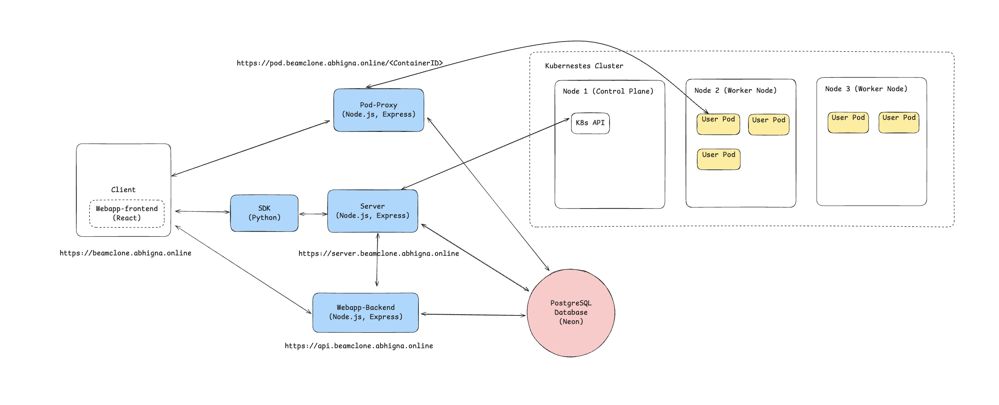
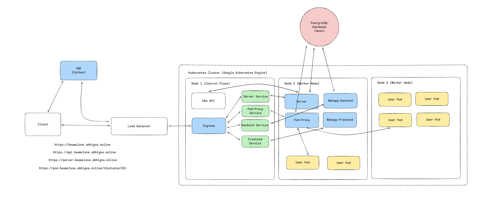

# 🚀 Beam Cloud Clone

A full-stack, container-based serverless platform inspired by [Beam.cloud](https://www.beam.cloud/). This clone enables developers to run python functions in containers and also deploy any container using any image present on Docker Hub. The platform supports user authentication, API key generation, and HTTP routing to user containers using Kubernetes, Nginx Ingress, and HTTPS.

- [Try it out](https://beamclone.abhigna.online)
- [Video Demo](https://drive.google.com/file/d/1_DXQNVYFgpp9q1ywRz7NFkeno8KbIZV7/view?usp=sharing)

## 🧱 Architecture Overview

This monorepo consists of five core services:

### 1. `sdk/` – Python SDK

A Python SDK that enables developers to:

- Authenticate using API keys.
- Define serverless functions using the `@function` decorator.
- Deploy and run functions inside isolated containers (pods).

### 2. `server/` – Core Deployment Server

- Receives and authenticates SDK requests.
- Builds and deploys containers (pods) on the Kubernetes cluster.
- Manages container lifecycles.

### 3. `webapp-frontend/` – User Interface

- Built using **React, TypeScript, TailwindCSS, ShadCN UI**.
- Allows users to register, log in, and view their API keys.
- Dashboard for monitoring deployed containers.

### 4. `webapp-backend/` – Backend for Web App

- Built with **Node.js, TypeScript, Express**.
- Handles authentication, user management, and API key issuance.
- Interacts with a **PostgreSQL** database via **Prisma ORM**.

### 5. `pod-proxy/` – Pod Routing Proxy

- Proxies incoming pod requests to the appropriate container.
- Example: `https://pod.<BASE_URL>/<ContainerID>` forwards to the correct container’s `/` route.
- Built with **Node.js, TypeScript, Express**.

## System Design



#### After Deploying All The Services In The Kubernetes Cluster



---

## 🧰 Tech Stack

| Layer                   | Stack & Tools                                                            |
| ----------------------- | ------------------------------------------------------------------------ |
| Container Orchestration | **Google Kubernetes Engine (GKE)**, `kubectl`, `@kubernetes/client-node` |
| Frontend                | **React**, **TypeScript**, **TailwindCSS**, **ShadCN UI**                |
| Backend APIs            | **Node.js**, **TypeScript**, **Express**, **Prisma ORM**                 |
| Reverse Proxy           | **Nginx Ingress Controller**                                             |
| Containerization        | **Docker**, Docker Hub                                                   |
| SDK                     | **Python**                                                               |
| Database                | **PostgreSQL** (hosted on [Neon](https://neon.tech))                     |
| Certificate Management  | **cert-manager**, **Let's Encrypt**                                      |

---

## 🗺️ Deployment

- All services are containerized using Docker and pushed to Docker Hub.
- Deployed on a GKE cluster using `Deployment` and `Service` YAML manifests.
- External traffic is routed using an **Nginx Ingress Controller** with HTTPS enabled via **cert-manager** and **Let's Encrypt**.
- Each service is exposed internally via Kubernetes services, and externally (if needed) via Ingress.

---

## 🧪 How to Use the SDK

- #### Container Example

```python
from sdk import Client
from sdk.pod import Pod
client = Client(api_key="YOUR_API_KEY")

pod = Pod(client, image="nginx:latest", ports=[80])

response = pod.create()

print(response)
```

- #### Function Example

```python
from sdk import Client
from sdk.function import function

client = Client(api_key="YOUR_API_KEY")

@function(client=client)
def test():
    print("Hello from the function")
    return "Hello World"

print(test())

res = test.remote()

if(res['success']):
    print(res['result'])
else:
    print(res['message'])
```
